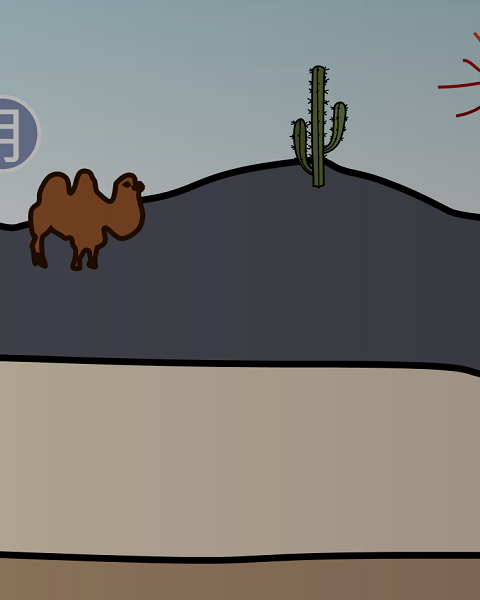

Flappy SVG
==========

Flappy-SVG ist ein Hindernislauf. Du kannst eigene Charaktere, Level und Funktionalität hinzufügen. Dieses Spiel wird von Leuten wie dir entwickelt und durch eine offene Gemeinschaft, [Fossasia](http://fossasia.org/), dabei unterstützt.
Du kannst uns unterstützten und etwas beitragen, beides auf einfache und freie Weise: [hier](https://github.com/fossasia/flappy-svg/).

[SPIELEN]
- Tippe oder klicke das Bild, um zu fliegen.
- Weiche Hindernissen aus und schaffe es so weit wie möglich.
