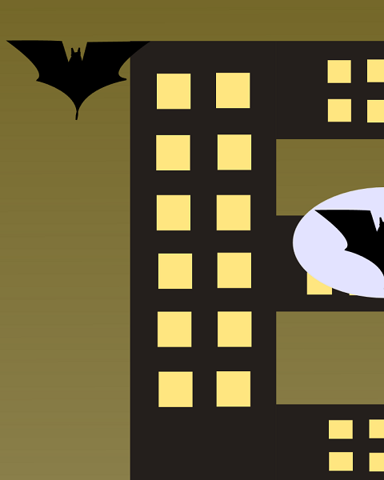
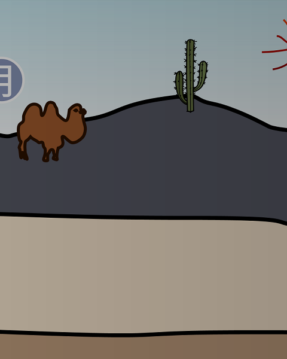

Flappy SVG
==========

Flappy-SVG is an obstacle-based game where you can add your own characters, levels and functionality to. The game is built by students and people just like you. It is supported by an open community, [Fossasia](http://fossasia.org/).
You can also support and contribute to this game in a simple and free way [here](https://github.com/fossasia/flappy-svg/).

[HOW TO PLAY]
- Tap screen to fly.
- Avoid obstacles and get as far as you can.
