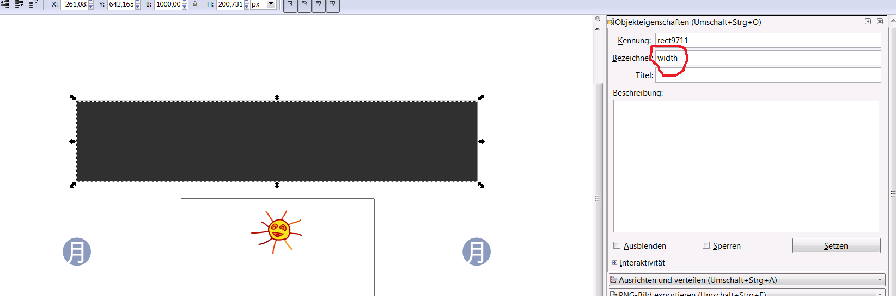

Implementation Hints
====================

Here are some hints to ease starting.

Testing
-------

- Test it the game in different browsers: Firefox, Google Chrome, Internet Explorer, Safari, Opera, your tablet or smartphone

Background
----------

- To create backgrounds or obstacles that repeats, you can add a rectangle to the layer whihc is out of vision and label it "width". Press Control+Shift+O to open the menu. 

SVG
---

- Reduce the size of the SVG file by using clones instead of copies. Alt+D Second menu, in the middle -> clones.
